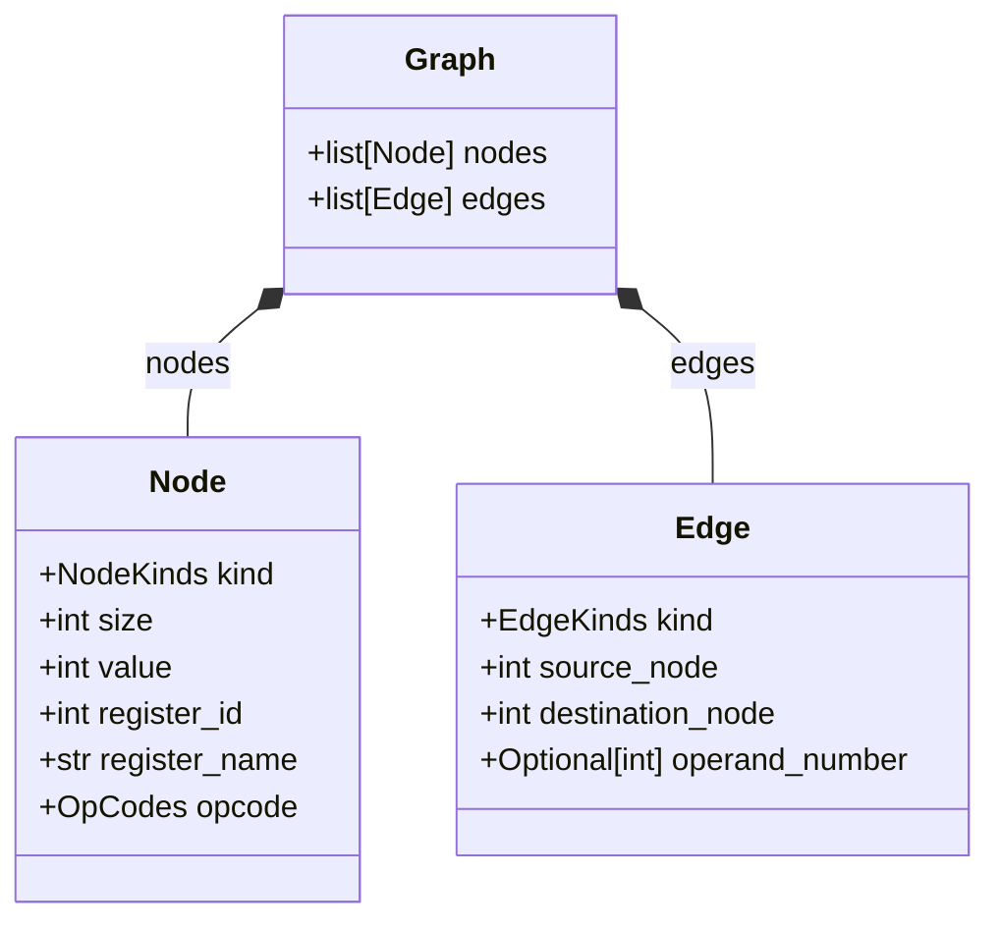

# P-Code Graph

This library helps to build, display and vectorize the Control-Data Graph (CDG) of a
chunk of binary code, using Ghidra P-Code representation.

## Command-line interface

A `cdg` tool is provided to play with binary of assembly files.

For example to dump the CDG of a function in markdown format:

```console
(venv) $ cdg mermaid test.o -f func -o graph.md
```

Or to display the graph of the whole content of an assembly file in HTML:

```console
(venv) $ cdg html test.asm -o graph.html
```

## Tests

### Run tests

```console
(venv) $ python -m pytest tests
```

### Test output

Tests using the `outdir` fixture generate their files in a dedicated output
directory, in which you can usually find:

  - the log file
  - the dump of P-Code operations
  - the dump of generated graph in markdown+mermaid format
  - a HTML file to display the related graph in a browser

You can display the dataflow graph resulting from a test in its output directory:

```console
$ firefox out/tests/maker_test/test_call/graph.html
```

## API

### Graph representation

The `graph.py` module contains the data classes defining a CDG.



### Build a graph


We use LIEF library as a default binary loader. To build a graph from binary code:

```python
from pcode_graph.maker import make_graph_from_binary
from pcode_graph.pcode import Translator
from pcode_graph.arch import Arch
from pcode_graph.lief_importer import iter_functions

translator = Translator(Arch.x86_64)

for function in iter_functions(Path("a.out")):
    graph = make_graph_from_binary(translator, 
                                   function.content, 
                                   function.address,
                                   ignore_flag_outputs=True)
```

Note that you can alternatively collect basic blocks (see lief_importer.py module), or use your own loader and make a graph from an arbitrary piece of binary code.

For testing purpose, you can also build it from assembly:

```python
from pcode_graph.maker import make_graph_from_asm
from pcode_graph.asm import Assembler
from pcode_graph.pcode import Translator
from pcode_graph.arch import Arch

translator = Translator(Arch.arm_64)
assembler = Assembler(Arch.arm_64)
asm = """
add x0, x1, x2
blr x16
mul x1, x0, x0
"""

graph = make_graph_from_asm(assembler, translator, asm)
```

### View the graph

You can unparse the graph into markdown using the mermaid syntax:

```python
with open("graph.md", "w") as f:
    f.write(str(graph))
```

The module `pcode_graph.view` wraps the `pyvis` library to display graphs in a browser:

```python
from pcode_graph.view import draw_graph

draw_graph(graph, "out/graph.html", open_browser=True)
```

### Vectorize the graph

To convert a graph to tensors, you will need the list of the registers
you expect your model to know, in order to convert the references to
these registers into tensors.

If you know in advance a list of interesting registers, the `map_registers` function will create a `dict` that maps these registers and their alias to an hot-encoded vector:

```python
from pcode_graph.gnn_exporter import map_registers

reg_map = map_registers("rsp", "rax", "rbx", "rsi", "rdi")
```

Then you can export your graph to a GNN as a torch_geometric Data object:

```python
data = graph_to_data(graph, reg_map)
assert data.x is not None
```

If you want to help your GNN to deal with different architectures, a helper is provided to encode registers as a mask, depending on their role regarding the calling convention:

```python
from pcode_graph.gnn_exporter import map_calling_convention_registers

reg_map = map_registers(Arch.x86_64)
print(reg_map)
{'rax': tensor([1, 0, 0, 0, 0, 0, 0, 0, 0, 0, 0, 0, 0, 0, 0, 0, 0, 0, 0, 0, 0, 0, 0, 0]),
 'rdx': tensor([0, 0, 0, 0, 0, 0, 1, 0, 0, 1, 0, 0, 0, 0, 0, 0, 0, 0, 0, 0, 0, 0, 0, 0]),
 'rdi': tensor([0, 0, 0, 0, 0, 0, 0, 1, 0, 0, 0, 0, 0, 0, 0, 0, 0, 0, 0, 0, 0, 0, 0, 0]),
 'rsi': tensor([0, 0, 0, 0, 0, 0, 0, 0, 1, 0, 0, 0, 0, 0, 0, 0, 0, 0, 0, 0, 0, 0, 0, 0]),
 ...
```

Many options are provided by the `graph_to_data` function depending on how you want to export graph information into node and edges features. Look at the function documentation for more details.


### Converting into networkx

In case you want to apply some classical graph-theory algorithms, you can use `export_to_networkx` from `nx_exporter` module:

```python
def export_to_networkx(graph: CDG, ignore_cfg: bool) -> nx.MultiDiGraph: ...
```